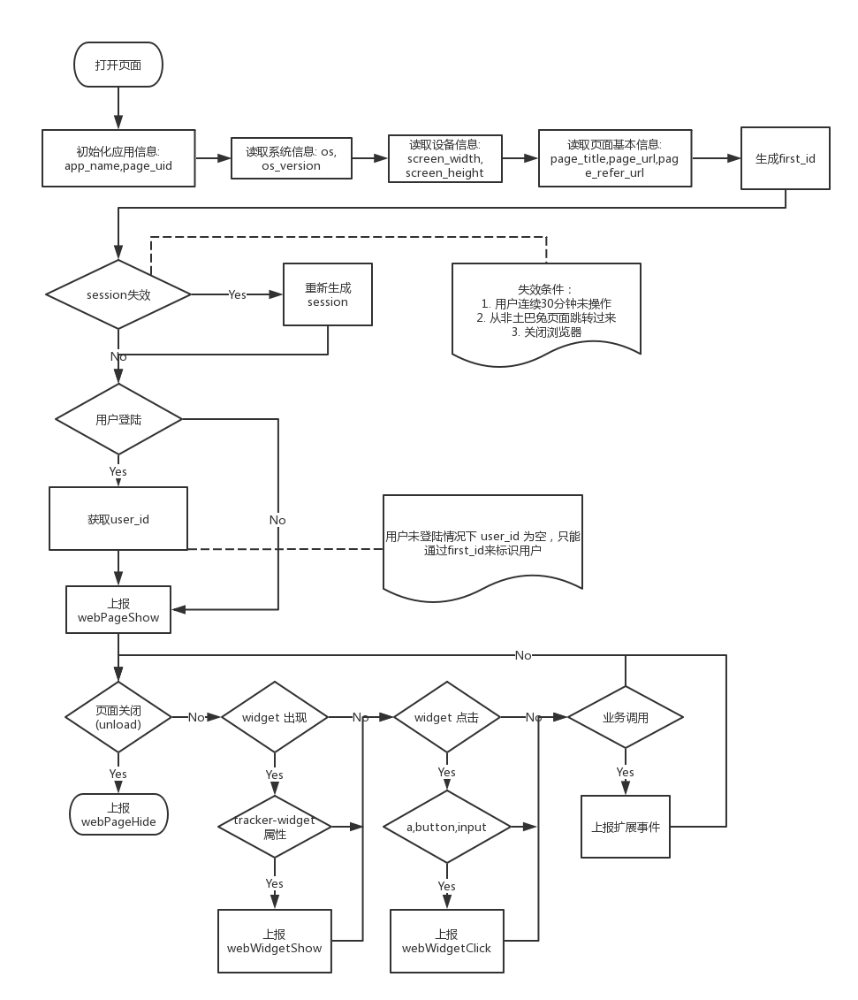

# 软件架构设计

## 时序图

## 流程图

## 类图

1. Tracker

属性：

- lib_version
- para_default
- para
- store

方法：

- quick
- track
- trackLink
- trackLinks
- setProfile
- setOnceProfile
- appendProfile
- incrementProfile
- deleteProfile
- unsetProfile
- identify
- trackSignup
- trackAbtest
- registerPage
- clearAllRegister
- register
- registerOnce
- registerSession
- registerSessionOnce
- login
- logout
- getPresetProperties
- init
- initPara

2. saEvent

属性:

- checkOption

方法：

- check
- send
- debugPath

3. commonWays

方法：

- isReady
- getUtm
- getStayTime
- setProfileLocal
- setInitReferrer
- setSessionReferrer
- setDefaultAttr
- trackHeatmap
- trackHeatMap
- autoTrackSinglePage
- autoTrackWithoutProfile
- autoTrack

4. heatmap

方法：

- getDomIndex
- selector
- getDomSelector
- na
- i
- getBrowserWidth
- getBrowserHeight
- getScrollWidth
- w
- start
- hasElement
- initScrollmap
- initHeatmap
- prepare

5. dataSend

方法：

- getSendUrl
- getSendData
- getInstance
- image
- ajax
- beacon

6. saNewUser

属性：

- is_first_visit_time

方法：

- checkIsAddSign
- checkIsFirstTime
- setDeviceId
- storeInitCheck
- checkIsFirstLatest

7. utils

方法：

- logger
- extend
- extend2Lev
- coverExtend
- isArray
- isFunction
- isArguments
- toArray
- values
- indexOf
- filter
- inherit
- trim
- isObject
- isEmptyObject
- isUndefined
- isString
- isDate
- isBoolean
- isNumber
- isElement
- isJSONString
- decodeURIComponent
- encodeDates
- hashCode
- formatDate
- searchObjDate
- searchZZAppStyle
- formatJsonString
- formatString
- searchObjString
- searchConfigData
- unique
- strip_sa_properties
- strip_empty_properties
- utf8Encode
- base64Encode
- UUID
- getQueryParam
- urlParse
- addHashEvent
- cookie
- getEleInfo